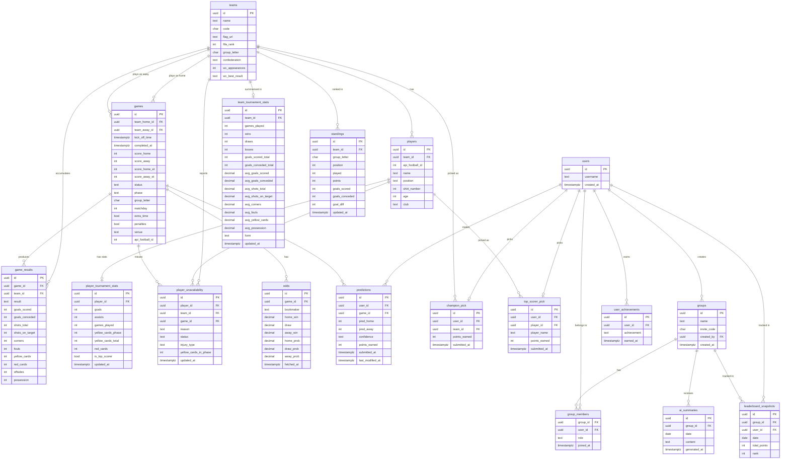

> ⚠️ OUTDATED — Preliminary design document. This ERD was created early in planning and does NOT reflect the live database schema.
> For the live schema, see: `.claude/skills/db-feature/SKILL.md`
> Notable differences: this doc contains tables that were never built (teams, players, standings, leaderboard_snapshots, user_achievements, player_unavailability), uses forbidden columns (games.status, group_members.role, predictions.confidence), and has different column names than the live DB.

---

# World Cup 2026 — Entity Relationship Diagram (Early Design)

---

## Views (derived — no extra storage)

| View | Derives From | Purpose |
|---|---|---|
| `leaderboard` | predictions + champion_pick + top_scorer_pick | Total points, rank, tiebreakers (exact score count) |
| `daily_leaderboard` | predictions + games.completed_at (today) | Points earned today per user |
| `user_streaks` | predictions + games ordered by kick_off_time | Current and best correct outcome streak per user |
| `top_10_scorers` | player_tournament_stats ORDER BY goals DESC LIMIT 10 | Tournament golden boot race |
| `top_10_assisters` | player_tournament_stats ORDER BY assists DESC LIMIT 10 | Tournament top assist providers |

---

## Table Notes

### `teams`
- `wc_appearances`, `wc_best_result` — seeded from `Team data.txt` at setup
- Static for the tournament, no sync needed

### `games`
- `team_home_id` / `team_away_id` nullable — knockout rows inserted only once matchups confirmed
- `score_home` / `score_away` — score at 90 min, used for prediction comparison
- `score_home_et` / `score_away_et` — null unless game went to extra time, display only
- Final display score: `COALESCE(score_home_et, score_home)`
- `extra_time`, `penalties` — booleans set on completion
### `game_team_comparison` view
- Given a `game_id`, returns for each team: avg goals scored per game, avg goals conceded, avg yellow cards, avg corners, W/D/L record in tournament so far
- Derived entirely from `game_results` + `games` — no extra storage
- Displayed side-by-side on `game.html` pre-kickoff

### `player_tournament_stats`
- One row per player, updated after each game
- `yellow_cards_phase` — resets after Round of 16 (WC rules)
- `yellow_cards_total` — full tournament count, display only
- `is_top_scorer` — set at tournament end to trigger `top_scorer_pick` points awarding

### `player_unavailability`
- `reason`: `injury` / `yellow_card_suspension` / `red_card_suspension`
- `status`: `out` / `doubtful` — doubtful only for injuries, not suspensions
- `injury_type`: text, nullable — only for injuries
- `yellow_cards_in_phase`: int, nullable — context shown on UI ("2nd yellow — suspended")
- `game_id`: the specific game the player will miss
- Populated by `sync-injuries` (injuries) and `sync-results` (card suspensions) Edge Functions

### `predictions`
- UNIQUE constraint on `(user_id, game_id)`
- Scored against `games.score_home` / `score_away` (90 min score)
- `confidence`: `low` / `medium` / `high` — user self-rated, social + AI roast material
- `last_modified_at` — for AI summary fun facts ("changed pick 3 min before kickoff")

### `user_achievements`
- One row per achievement per user
- Examples: `perfect_score`, `underdog_3x`, `streak_5`, `early_bird`, `last_minute_change`
- Awarded by `sync-results` Edge Function after each game
- UNIQUE constraint on `(user_id, achievement)` — can't earn same badge twice

### `champion_pick` / `top_scorer_pick`
- UNIQUE constraint on `user_id`
- Lock permanently at June 11 2026 kickoff

### `leaderboard_snapshots`
- Written nightly by the same cron that runs AI summaries
- Enables "climbed X spots today" logic in the AI roast

### `odds`
- `home_prob` / `draw_prob` / `away_prob` — implied probability stored pre-calculated
- Avoids recalculating on every frontend render

### `group_members`
- PK: `(group_id, user_id)`
- `role`: `captain` / `member`

---

## Constraints Summary

| Table | Constraint |
|---|---|
| `predictions` | UNIQUE (user_id, game_id) |
| `champion_pick` | UNIQUE (user_id) |
| `top_scorer_pick` | UNIQUE (user_id) |
| `group_members` | PK (group_id, user_id) |
| `player_tournament_stats` | UNIQUE (player_id) |
| `standings` | UNIQUE (team_id, group_letter) |
| `odds` | UNIQUE (game_id, bookmaker) |
| `user_achievements` | UNIQUE (user_id, achievement) |

---

## Edge Function → Table Mapping

| Edge Function | Writes To |
|---|---|
| `setup-tournament` | teams, players, games (group stage) |
| `sync-results` | games, game_results, standings, player_tournament_stats, player_unavailability (suspensions), user_achievements |
| `sync-knockouts` | games (new knockout rows) |
| `sync-odds` | odds |
| `sync-injuries` | player_unavailability (injuries only) |
| `nightly-summary` | leaderboard_snapshots, ai_summaries |
